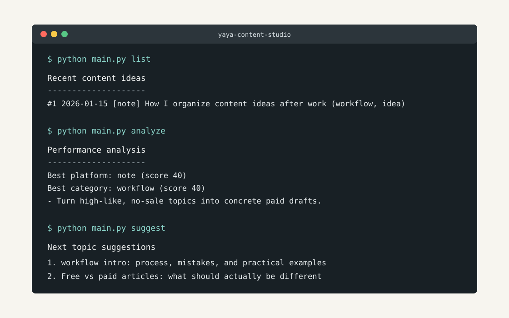

# yaya-content-studio

Language: [繁體中文](README.md) | [English](README.en.md) | [日本語](README.ja.md)

`yaya-content-studio` 是一個給個人內容創作者使用的本機 CLI 工具。

它不是文章生成器，也不會幫你自動發文。它比較像一個很安靜的內容經營助理：幫你把靈感收好、把草稿存好、把文章表現記下來，然後用簡單規則提醒你下一篇可以寫什麼。

第一版完全在本機運作，不串 API、不需要帳號、不會把你的文章送到外部服務。資料都用 CSV 和 Markdown 存在專案資料夾裡，想搬走、備份、改格式都很容易。



## Project Links

- [Usage examples](docs/usage_examples.md)
- [Content strategy notes](docs/content_strategy.md)
- [Launch article draft](docs/launch_article.md)
- [Roadmap](docs/roadmap.md)

## 適合誰使用

這個工具適合這樣的人：

- 有在寫 note、Medium、Threads 或 X
- 常常有很多靈感，但後來找不到、忘記為什麼想寫
- 想把免費文章和付費文章分開經營
- 想知道哪些主題有反應，而不是只靠感覺決定下一篇
- 喜歡 Markdown、CSV、本機檔案這種簡單透明的工作流
- 不想一開始就把內容流程接到一堆平台或 API

它特別適合個人創作者、小型知識工作者、在海外工作生活並想整理經驗的人。你可以把它當作自己的內容筆記本加小型經營儀表板。

## 安裝方法

先確認電腦有 Python 3：

```bash
python --version
```

如果你的系統沒有 `python`，可以試：

```bash
python3 --version
```

下載或 clone 專案後，進入資料夾：

```bash
cd yaya-content-studio
```

第一版沒有第三方套件，所以通常不需要安裝 dependencies。`requirements.txt` 先保留給未來版本使用。

如果你想建立虛擬環境，也可以：

```bash
python -m venv .venv
source .venv/bin/activate
pip install -r requirements.txt
```

如果你的環境使用 `python3`，把上面的 `python` 改成 `python3` 即可。

## 基本使用流程

一個很普通、但真的能持續的流程大概是這樣：

1. 平常想到題目時，先用 `new` 記下來
2. 想開始寫時，用 `save` 存成 Markdown 草稿
3. 需要封面時，用 `cover` 生成免費 SVG 配圖
4. 手動整理、修改、發布到 note 或 Medium
5. 發布後過幾天，用 `stats` 記錄觀看、喜歡、留言、銷售等表現
6. 每週用 `analyze` 看哪些平台和主題有反應
7. 用 `suggest` 找下一篇可以延伸的主題

這個工具不會替你判斷人生方向，也不會說「只要照做就成功」。它只是幫你把內容經營裡那些容易散掉的小資訊收回來，讓你比較容易做下一個決定。

## 指令列表

所有指令都在專案資料夾內執行：

```bash
python main.py <command>
```

如果你的電腦沒有 `python` 指令，請改用：

```bash
python3 main.py <command>
```

### 新增文章題目

```bash
python main.py new
```

會詢問：

- platform: note / Medium / Threads / X
- title
- category
- target_reader
- paid: yes / no
- memo

資料會保存到：

```text
data/content_ideas.csv
```

欄位包含：

```text
id,date,platform,title,category,target_reader,paid,status,memo
```

`status` 預設是 `idea`。

### 保存文章草稿

```bash
python main.py save
```

會詢問：

- title
- platform
- category
- tags
- body markdown

`tags` 可以用逗號分隔，例如：

```text
Open Source, Python, Creator Tools, Local First, Markdown
```

輸入 Markdown 內文時，用單獨一行 `.` 結束。

文章會保存到：

```text
articles/YYYY/MM/YYYYMMDD_platform_title.md
```

檔案最上方會自動加入 metadata：

```markdown
---
title:
date:
platform:
category:
tags:
status: draft
---
```

### 生成免費封面圖

```bash
python main.py cover
```

會詢問：

- title
- platform
- category
- tags
- subtitle

這個指令不串 API，也不需要付費服務。它會在本機產生一張 SVG 封面圖：

```text
exports/covers/YYYY/MM/YYYYMMDD_platform_title_cover.svg
```

`exports/` 預設不會被 commit 到 GitHub，適合放個人文章素材。

### 列出最近內容

```bash
python main.py list
```

會顯示最近 20 筆：

- `data/content_ideas.csv` 裡的題目
- `articles/` 裡的 Markdown 草稿

### 記錄文章表現

```bash
python main.py stats
```

會詢問：

- date
- platform
- title
- views
- likes
- comments
- claps
- sales
- memo

資料會保存到：

```text
data/stats.csv
```

### 分析表現

```bash
python main.py analyze
```

會用簡單規則輸出：

- 哪個平台反應最好
- 哪個 category 反應最好
- 哪些文章有 likes 但沒有 sales
- 哪些文章適合改成付費文
- 下一步建議

第一版沒有 AI 分析，故意保持簡單，讓你看得懂它為什麼這樣建議。

### 推薦下一篇主題

```bash
python main.py suggest
```

會根據 `content_ideas.csv` 和 `stats.csv` 推薦 5 個下一篇主題。

目前規則包含：

- 避免和最近 5 篇主題太像
- likes 多但 sales 少時，建議改成更具體的付費題材
- 某個 category 反應好時，延伸系列文
- 同時輸出 note / Medium 兩種版本標題

## note / Medium 經營流程範例

假設你在日本工作，最近想寫「海外工作後，如何整理內容靈感」這個主題。

### 1. 先記成 idea

```bash
python main.py new
```

可以這樣填：

```text
platform: note
title: 日本工作後如何整理內容靈感
category: workflow
target_reader: 在日本工作的台灣內容創作者
paid: no
memo: 先寫免費文，重點放在共鳴和日常流程
```

### 2. 寫 note 免費文

用 `save` 存草稿：

```bash
python main.py save
```

Medium 文章可以先用這組 tags：

```text
Open Source, Python, Creator Tools, Local First, Markdown
```

如果需要 note 或 Medium 封面，可以再跑：

```bash
python main.py cover
```

它會產生一張不需要任何 API 費用的 SVG 封面。

note 版本可以比較個人一點，像是：

- 為什麼一開始會想整理靈感
- 在日本工作後，生活節奏怎麼影響寫作
- 自己試過哪些方法但失敗
- 現在用什麼方式收集題目
- 給同樣在海外工作的人的小建議

免費文的目標不是把所有答案都講完，而是讓讀者覺得：「這個人真的懂我的狀態。」

### 3. 延伸成 Medium 文章

如果 note 版本反應不錯，可以再寫 Medium 版本。Medium 可以更結構化：

- 問題背景
- 過去做法為什麼失效
- 現在的整理流程
- 實際例子
- 給讀者可照做的步驟

同一個主題不一定要複製貼上。note 可以更貼近日記和經驗，Medium 可以更像整理後的方法文。

### 4. 記錄表現

```bash
python main.py stats
```

例如：

```text
views: 1200
likes: 45
comments: 6
claps: 0
sales: 0
memo: 共鳴高，但還沒有付費轉換
```

### 5. 決定下一步

跑：

```bash
python main.py analyze
python main.py suggest
```

如果系統發現 likes 多但 sales 少，下一篇就可以不要再寫泛泛的心得，而是改成更具體的付費題材，例如：

- 我如何把 30 個零散靈感整理成 5 篇 note 文章
- 海外工作者的內容題材整理模板
- 從 Threads 短文延伸成 note 付費文的流程

付費文要更具體，最好包含流程、失敗、模板和實際例子。不要寫誇張成功學，也不要寫「誰でもできます」這種太輕飄飄的句子。

## 未來 Roadmap

### v1: 本機 CLI

- 新增文章題目
- 保存 Markdown 草稿
- 列出最近 idea 和文章
- 記錄文章表現
- 用簡單規則分析表現
- 推薦下一篇主題

### v2: 更完整的本機工作流

- 搜尋和篩選 ideas
- 更新文章狀態，例如 idea、draft、published、archived
- 產生每週內容回顧
- 增加付費文章模板
- 匯出指定平台的草稿包

### v3: 選配整合

- 可選的 AI 摘要或改寫輔助
- 可選的平台資料匯入
- 可選的內容行事曆

自動發文不會是早期目標。對個人創作者來說，先把自己的內容節奏、主題判斷和草稿品質穩住，比把工具接滿更重要。
